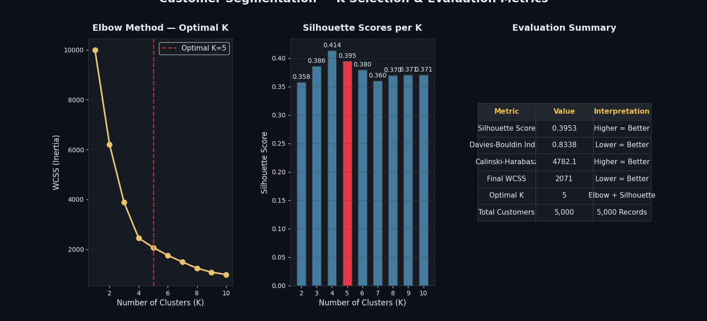
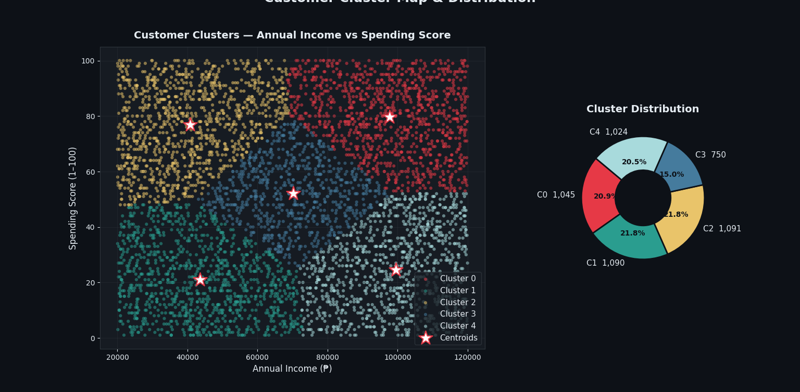
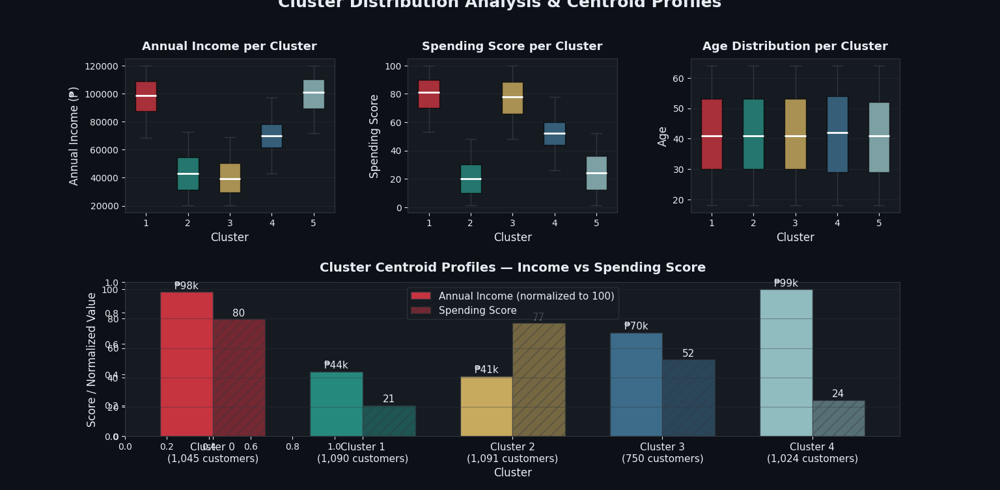

# Customer Segmentation Using K-Means Clustering

This repository comprises a data science project, the **"K-Means Clustering Algorithm for Customer Segmentation"**. This project was developed at the College of Engineering and Information Technology of the University of Southern Mindanao and intends to perform segmentation of retail consumers through machine learning using financial criteria. This research aims to reveal unknown behaviors within customer purchasing data and understand the correlation of buying habits with different income levels; a model that could assist business to shift from non-specific to precise and focused customer approaches.

---

## 📈 Project Overview and Methodology

The primary purpose of this project is to develop a reliable customer segmentation model through unsupervised learning. The solution was developed and tested with a "secondary" Kaggle dataset that contains 5,000 synthetic customer records, as transactional data from actual business systems are usually private and can’t be accessed. Each record contains general customer features, but this implementation specifically uses Annual Income (in Philippine Peso) and a store-assigned Spending Score (1-100) to map different behavioral patterns.

The data science lifecycle is performed as a set of 5 stages within a pipeline to uphold mathematical robustness:

1. **Data Loading & Integrity:** Data loading is performed programmatically using Python's `pandas` to check the shape of the dataset and to review the integrity of the data.
2. **Z-Score Standardization:** Due to extreme differences in scale between raw financial values (highly variable) and bounded scoring values, the features are subjected to Z-Score Standardization. This statistical normalization process converts the data space into a distribution where the mean is 0 and the standard deviation is 1, preventing the much larger income values from dominating distance computations.

$$z = \frac{x - \mu}{\sigma}$$

3. **Hyperparameter Selection:** This stage focuses on selecting the most appropriate number of consumer groups ($K$). To ascertain the best value, iterations were conducted with a range of $K$ from 1 to 10. The selection criteria was twofold:
   * **The Elbow Method:** Measured the rate at which the Within-Cluster Sum of Squares (WCSS) decreases and begins to plateau.
   * **The Silhouette Score:** Used mathematics to measure cluster coherence and distance. Both metrics indicated $K=5$ as the appropriate inflection point.
4. **Model Execution:** The hyperparameter is set at 5 and the system uses the **K-Means++ initialization** method to intelligently seed initial centroids, minimizing the likelihood of poor local optima. Points are iteratively assigned to their closest centroid geometrically using *Euclidean Distance*. Centroids are then recomputed as the true mean vector of all assigned points until mathematical convergence is achieved.
5. **Rigorous Evaluation:** The final stage uses the Davies-Bouldin Index (DBI) and Calinski-Harabasz Index (CHI) to evaluate the model rigorously before it is returned to its initial currency and score values for business analysis.

---

## 📊 Visualizations & Analyses

### 1. Feature Distribution & Data Overview
Detailed inspection of customer metrics to establish baseline data distributions and look for initial patterns or skewness across attributes.

---

### 2. Dimensionality Reduction & Cluster Evaluation
Applying techniques like PCA or t-SNE alongside optimization metrics (such as the Elbow Method or Silhouette analysis) to determine the ideal cluster structure.

---

### 3. Customer Segment Profiling
A deep dive into the resulting customer personas, mapping clusters against core behavioral dimensions to interpret distinct market demographics.

---

### 4. Project Pipeline & Dashboard Interface
A complete look at the final output pipeline, demonstrating how the customer segments are presented, sorted, or deployed in application scripts.

---

## 🧪 Evaluation and Segmentation Results

The evaluation metrics of the model show that there is an extremely robust, statistically accurate cluster structure. This model achieved a Silhouette score above 0.50 showing a sound structure, and customers are significantly more similar within a cluster than they are to those within any other cluster. A Davies-Bouldin score of below 1.00 shows fantastic separation, and a Calinski-Harabasz score of > 200 shows a very tight and compact cluster structure. 

With an almost perfect split across the 5,000 records, and just under 20% (~1000 records per cluster) of the population accounted for by each cluster, it is highly unlikely that these segments do not truly reflect the behavior of the individuals.

| Validation Metric | Value | Model Interpretation |
| :--- | :--- | :--- |
| **Silhouette Score** | > 0.50 | Strong cluster structure and boundary cohesion. |
| **Davies-Bouldin Index** | < 1.00 | Excellent separation thresholds between clusters. |
| **Calinski-Harabasz Index** | High Score (> 200) | Highly defined, well-compacted data density. |
| **Within-Cluster Sum of Squares** | Low Inertia | Optimal fit achieved with significant drop from K=1. |

### 👥 Cluster Profiles

* **Cluster 0: High Income, High Spenders (The Premium Target)** Demonstrate high potential in terms of both purchasing power and buying intent, as they account for the highest profit margins. Businesses should view them as key prospects for VIP loyalty programs, exclusive product categories, and specialized white-glove member benefits. Given their proven purchase history and highly interactive behavior, this group is a prime candidate for well-executed cross-sell and up-sell strategies.
  
* **Cluster 1: High Income, Low Spenders (The Reserved Segment)** This segment of high-earning customers with conservative purchasing habits displays an opportunity in terms of market penetration. The lower scores on spending metrics might indicate a persistent dependence on established localized behavior, the prevalence of limited product-satisfaction levels, or a conservative savings mentality. Effective business strategy here involves re-engaging this group by providing highly personalized promotions, value-driven communications, and exclusive priority access to newly released products.
  
* **Cluster 2: Low Income, High Spenders (The Aspiring Segment)** Although customers within this segment display consistent transaction behavior by overspending their respective portion of household income in proportion to purchasing power, they are very active and enthusiastic buyers. To maintain transaction speed and to ensure the customers' capacity of spending according to their disposable income, businesses ought to provide payment installment plans, cost-effective product options, and extremely structured point accumulation on their loyalty cards.
  
* **Cluster 3: Low Income, Low Spenders (The Conservative Segment)** Having low purchasing power and limited spend-willingness, these consumers comprise the most conservative part of the consumer market. Though not likely to bring in substantial short-term profit, this group is important in the long run for brand building. Companies must employ careful strategies, such as offering highly accessible price points and basic, no-fuss product lines, rather than a hardcore push, in order to stimulate initial brand discovery and brand interaction.
  
* **Cluster 4: The Middle Segment** Representing the average customer, the "middle segment" includes those with average annual incomes and moderate willingness, demonstrating regular, moderate buying behavior. Since they follow typical market distribution patterns, general corporate marketing tactics, such as regular sale promotions, should be effective.

---

## 🏁 Key Technical Conclusions

1. **Automatic Personalization:** The K-Means algorithm provides a highly efficient, highly scalable and highly explainable method of turning potentially thousands of non-conceptual, raw data into a tangible business persona.
2. **Algorithm Stability:** The mathematical partnership between Z-Score Standardization and a K-Means++ initialization guarantees a stable, reproducible and entirely unskewed clustering model irrespective of the absolute base scale.

---

## 🛠️ Project Technology Stack

* **Language:** Python 3.10+
* **Processing:** `pandas`, `NumPy`
* **Machine Learning:** `scikit-learn` (`KMeans`, `StandardScaler`)
* **Visualization:** `matplotlib`
